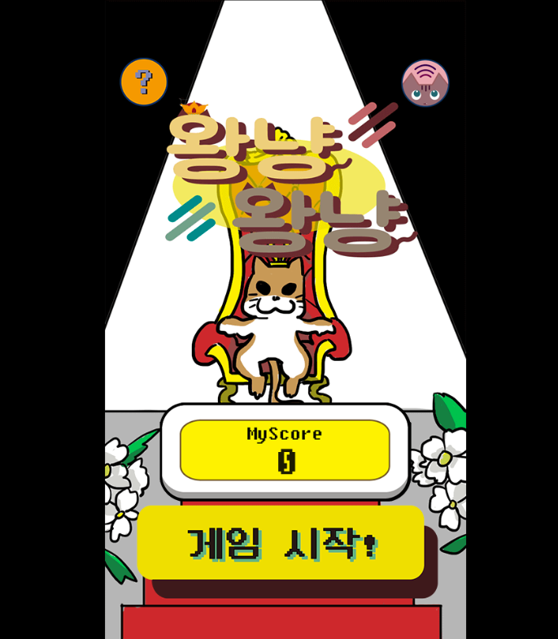
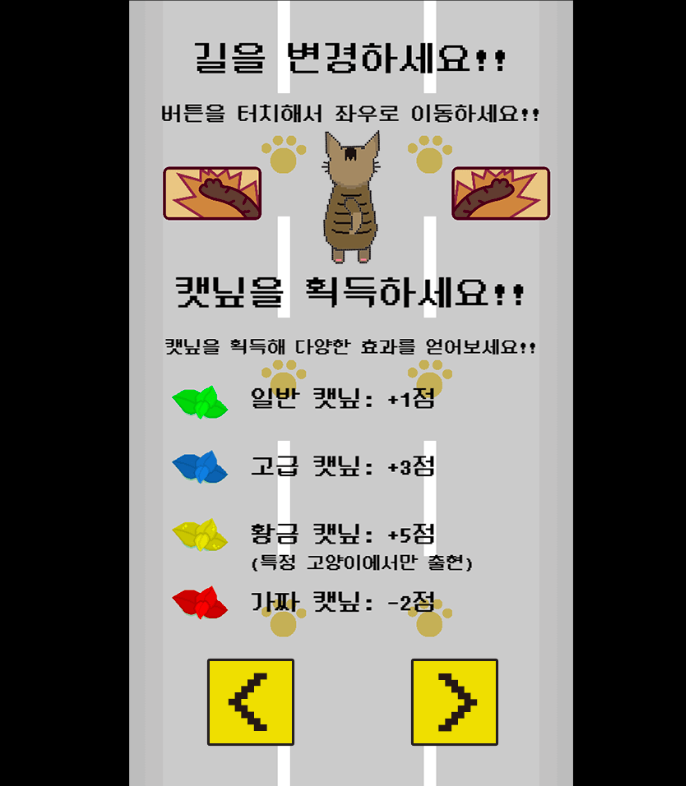
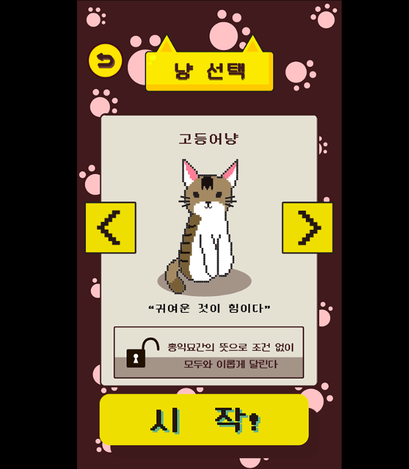
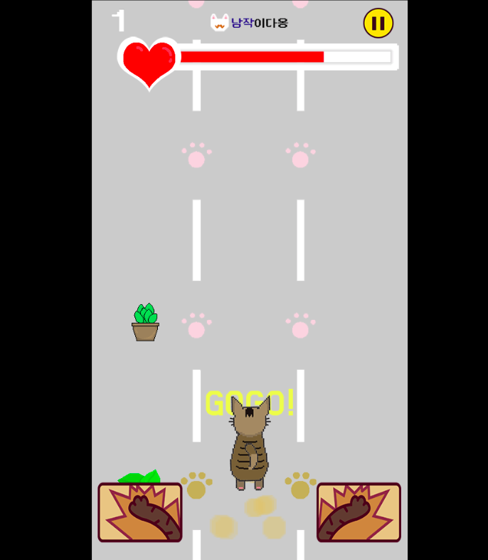
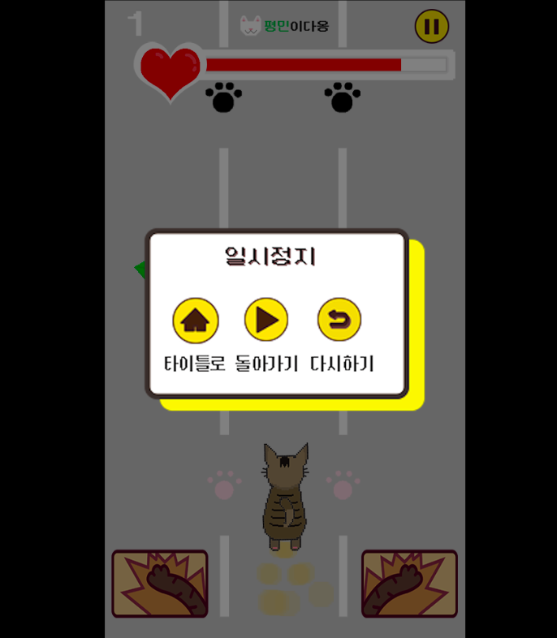
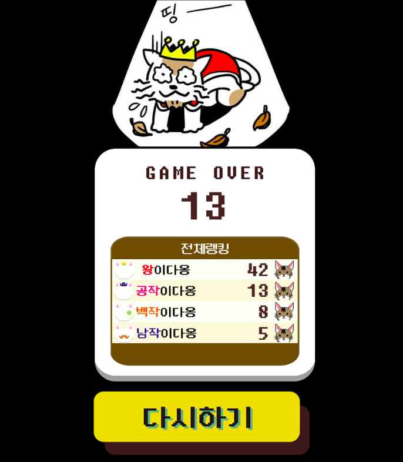

# KingCat_Phaser3
-------------
## 1. 목차
```
.HC_RhythmGame
├── 1.목차
├── 2.개요
├── 3.사용법
|   ├── 3.1.개발 언어
|   └── 3.2.실행 방법
|       ├── 3.2.1 실행 환경 세팅
|       └── 3.2.2 실행
└── 4.실행 사진
    ├── 4.1.Preloader 화면
    ├── 4.2.Prologue 화면
    ├── 4.3.MainMenu 화면
    ├── 4.4.Tutorial 화면
    ├── 4.5.Select 화면
    ├── 4.6.Play 화면
    ├── 4.7.Pause 화면
    └── 4.8.GameOver 화면
```


## 2. 개요
 - **Phaser.js(ver.3)** 로 개발한 **3라인 횡스크롤 웹 레이싱 게임**입니다.
 - 제 1회 카카오스낵게임 공모전에 출품하였습니다.
 - This repository is for developing KingCat that kakao HTML5 game contest entry to Phaser3 engine from Phaser2 CE.


## 3. 사용법
### 3.1. 개발 언어 & 기술
- Language & Framework : Phaser.js(ver.3) / Node.js
- DB : MySQL


### 3.2. 실행 방법
#### 3.2.1 실행환경 세팅
```
# 1. node.js와 MySQL 설치
# 2. MySQL에 "game_data" 스키마 생성 / 해당 스키마 안에서 "db_qeury.sql" 실행 (user_info 테이블 생성과 컬럼 추가)
# 3. server.js 를 열어 본인의 MySQL user와 password 값 입력.
```
#### 3.2.2 실행
```
# 1. 터미널에서 이 프로젝트가 있는 경로로 들어가 "node server.js" 를 입력
# 2. 서버가 실행됐다는 알림이 뜨면 웹 브라우저의 주소창에 "localhost:8081" 입력
# 3. 게임이 실행됨.
```


## 4. 실행 사진
### 4.1. Preloader 화면
 
 -------------

### 4.2. Prologue 화면
 
 -------------
 
### 4.3. MainMenu 화면
 
 -------------
 
### 4.4. Tutorial 화면
 
 -------------
 
### 4.5. Select 화면
 
 -------------
 
 ### 4.6. Play 화면
 
 -------------
 
 ### 4.7. Pause 화면
 
 -------------
 
  ### 4.8. GameOver 화면
 
 -------------
